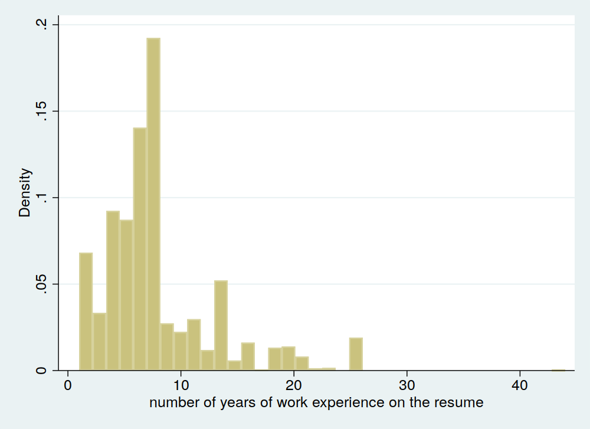
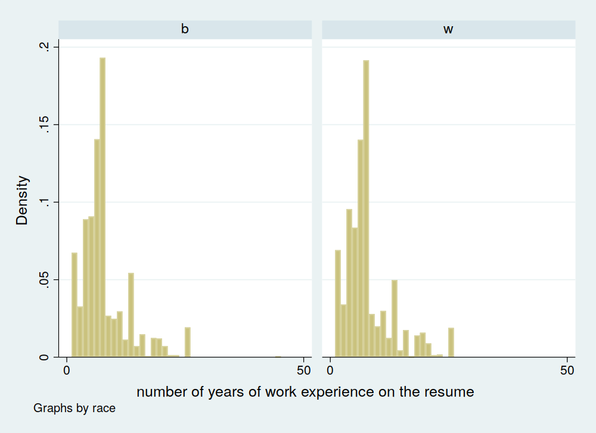

# Module 3 Stata Tutorial

This tutorial introduces the Stata commands associated with the content in __Module 3: Statistical inference (basics)__.

The data we use is from a study by Marianne Bertrand and Sendhil Mullainathan who wanted to measure racial prejudice in the US labor market (citation: Bertrand, Marianne, and Sendhil Mullainathan. 2004. "Are More Employable Than? A Field Experiment on Labor Market Discrimination." American Economic Review, 94 (4): 991-1013. DOI: 10.1257/0002828042002561).  They conducted an RCT in which fictitious resumes were sent to employers in Boston and Chicago. Some of the made-up applicants had names more typical of African- and Asian-Americans, like Lakisha and Jamal, while others had names that were more typically associated with white people, like Emily and Greg.  Apart from the names, the resumes were identical, and Marianne and Sendhil wanted to know if employers responded differently. The data can be downloaded here (https://www.aeaweb.org/articles?id=10.1257/0002828042002561) or from the course page.

The data will be downloaded as a compressed (zip) file. You should unzip it before using the dta file.


## Part 1: Getting started

All of the commands in this tutorial should be written in a single Stata .do file. An example Module 3 .do file can be downloaded from the course page. To start a .do file, type doedit into the Stata command line then hit enter. You should save the file to a location where you will remember by selecting **File** then **Save as** from the menu (the upper left corner) of the .do file.

At the start of the .do file, enter the commands `drop _all` and `set more off`. The first command removes any data from Stata’s memory so that the script can run cleanly. The second command instructs Stata to execute the entire .do file at once instead of waiting for keyboard inputs at certain points. Both commands should go at the start of almost every .do file.

__Task 1:__ Clear Stata’s memory and set the more option to off

__Execution 1:__
```
drop _all
set more off
```

The next step is to use the command cd to set the working directory to the folder containing the data. For help using the command, you may type `help cd` in the Stata command line and then hit enter. After changing the working directory, import the data. Describe the data and confirm that there are 4,870 observations and 65 variables.

__Task 2:__

Change your working directory to the folder containing the data file, import the data, and describe the data.

__Execution 2:__

Suppose that your data is stored in `C:\\Data`. Then the command would be
```
. cd "C:\\Data"

. use lakisha_aer.dta, clear

.
. describe

Contains data from lakisha_aer.dta
  obs:         4,870                          
 vars:            65                          30 Dec 2003 12:24
 size:     1,076,270                          
---------------------------------------------------------------------------------------------------------------------------------------------------------------
              storage   display    value
variable name   type    format     label      variable label
---------------------------------------------------------------------------------------------------------------------------------------------------------------
id              str3    %9s                   ID
ad              str4    %9s                   Ad #
education       byte    %8.0g                 0=not reported; 1=HSD; 2=HSG; 3=some col; 4=col +
ofjobs          byte    %8.0g                 number of jobs listed on resume
yearsexp        byte    %8.0g                 number of years of work experience on the resume
honors          byte    %8.0g                 1=resume mentions some honors
volunteer       byte    %8.0g                 1=resume mentions some volunteering experience
military        byte    %8.0g                 1=applicant has some military experience
empholes        byte    %8.0g                 1=resume has some employment holes
occupspecific   int     %8.0g                 Occup. Specific
occupbroad      byte    %8.0g                 Occup. Broad
workinschool    byte    %8.0g                 1=resume mentions some work experience while at school
email           byte    %8.0g                 1=email address on applicant's resume
computerskills  byte    %8.0g                 1=resume mentions some computer skills
specialskills   byte    %8.0g                 1=resume mentions some special skills
firstname       str8    %9s                   applicant's first name
sex             str1    %9s                   
race            str1    %9s                   
h               float   %9.0g                 1=high quality resume
l               float   %9.0g                 1=low quality resume
call            float   %9.0g                 1=applicant was called back
city            str1    %9s                   c=chicago; b=boston
kind            str1    %9s                   
adid            float   %9.0g                 employment ad identifier
fracblack       float   %9.0g                 frac blacks in applicant's zip
fracwhite       float   %9.0g                 frac whites in applicant's zip
lmedhhinc       float   %9.0g                 log median HH income in applicant's zip
fracdropout     float   %9.0g                 frac HS dropouts in applicant's zip
fraccolp        float   %9.0g                 frac college educ or more in applicant's zip
linc            float   %9.0g                 log per capita income in applicant's zip
col             float   %9.0g                 applicant has college degree or more
expminreq       str4    %9s                   min experience required, if any
schoolreq       str6    %9s                   specific education requirement, if any
eoe             float   %8.0g                 1=ad mentions employer is EOE
parent_sales    float   %9.0g                 sales of parent company
parent_emp      float   %9.0g                 employment of parent company
branch_sales    float   %9.0g                 sales of branch
branch_emp      float   %9.0g                 emp of branch
fed             float   %9.0g                 employer is federal contractor
fracblack_emp~p float   %9.0g                 fraction blacks in employers's zipcode
fracwhite_emp~p float   %9.0g                 fraction whites in employer's zipcode
lmedhhinc_emp~p float   %9.0g                 log median HH income in employer's zipcode
fracdropout_e~p float   %9.0g                 fraction HS dropouts in employer's zipcode
fraccolp_empzip float   %9.0g                 fraction college or more in employer's zipcode
linc_empzip     float   %9.0g                 log per capita income in employer's zipcode
manager         float   %9.0g                 manager wanted
supervisor      float   %9.0g                 supervisor wanted
secretary       float   %9.0g                 secretary wanted
offsupport      float   %9.0g                 
salesrep        float   %9.0g                 sales representative wanted
retailsales     float   %9.0g                 retail sales worker wanted
req             float   %9.0g                 1=ad mentions any requirement for job
expreq          float   %9.0g                 1=ad mentions some experience requirement
comreq          float   %9.0g                 1=ad mentions some communication skills requirement
educreq         float   %9.0g                 1=ad mentions some educational requirement
compreq         float   %9.0g                 1=ad mentions some computer skill requirement
orgreq          float   %9.0g                 1=ad mentions some organizational skills requirement
manuf           float   %9.0g                 employer industry is manufacturing
transcom        float   %9.0g                 employer industry is transport/communication
bankreal        float   %9.0g                 employer industry is finance, insurance, real estate
trade           float   %9.0g                 employer industry is wholesale or retail trade
busservice      float   %9.0g                 employer industry is business and personal services
othservice      float   %9.0g                 employer industry is health, educ. and social services
missind         float   %9.0g                 employer industry is other/unknown
ownership       str10   %10s                  ownership status of employer
---------------------------------------------------------------------------------------------------------------------------------------------------------------
Sorted by:

.

```
__Notes:__ Quotes are only necessary in file or folder names if there are spaces in them, but they can always be used. The option `clear` is only necessary if there is already data loaded, but is useful to include in case you wish to only run a portion of the .do file later.

## Part 2: Summary statistics and histograms

In this section, we will calculate the sample average, variance, and standard deviation using Stata. We will then create a histogram plotting the data.

We will examine the variable `yearsexp` which, according to the variable label, indicates the number of years of work experience that were indicated on the fictitious resume. The sample mean, variance, and standard deviation can all be calculated with a single command. Calculate these statistics using the `summarize` command (hint: look at the `detail` option).

__Task 3:__ Calculate the sample average, variance, and standard deivation.

__Execution 3:__
```
. summarize yearsexp

    Variable |        Obs        Mean    Std. Dev.       Min        Max
-------------+---------------------------------------------------------
    yearsexp |      4,870    7.842916    5.044612          1         44

. summarize yearsexp, detail

      number of years of work experience on the resume
-------------------------------------------------------------
      Percentiles      Smallest
 1%            2              1
 5%            2              1
10%            3              1       Obs               4,870
25%            5              1       Sum of Wgt.       4,870

50%            6                      Mean           7.842916
                        Largest       Std. Dev.      5.044612
75%            9             26
90%           14             26       Variance       25.44811
95%           19             26       Skewness       1.685004
99%           26             44       Kurtosis       6.276497

```
__Notes:__ Across all resumes sent out, the average work experience was 7.84 years, ranging 1 to 44, with a standard deviation of about 5.04 years.  The first command yields a basic set of statistics, which, with further information, are included in the output the second command with the `detail` option. Notice that the mean, 7.8, is greater than the median, 6. This indicates that the distribution is skewed to the right. We can verify this in the histogram.

Now that we have calculated summary statistics, let's create a histogram. Use the `histogram` command to accomplish this. Save the histogram as a `png` file using the `graph export` command.

__Task 4:__ Plot a histogram of `yearsexp`

__Execution 4:__
```
. histogram yearsexp
(bin=36, start=1, width=1.1944444)
```

```
graph export "hist1.png", width(1000) replace
```
__Notes:__ The `width(1000)` option increases the size of the saved histogram to 1,000 pixels make it more visually appealing. Values other than 1,000 can be used depending on how large you want the image. The `replace` option tells Stata that it may overwrite an existing file with the same name. This allows the program to run if you run it multiple times.

It appears that the data has a rightward skew. One trick that can be useful for examining histograms is to overlay a normal distribution with the average and variance of your data. This can be done using a single option. Explore the `help histogram` page to figure out how to accomplish this task.

__Task 5:__ Plot a histogram of `yearsexp` with a normal distribution overlay.

__Execution 5:__
```
. histogram yearsexp, normal
(bin=36, start=1, width=1.1944444)
```


Finally, let's compare a histogram of `yearsexp` among the resumes that had an African- or Asian-American sounding name (`race=="b"`) to a histogram among applications with a White-sounding name (`race=="w"`).

__Task 6:__ Plot two histograms of `yearsexp` by `race`.

__Execution 6:__
```
. histogram yearsexp, by(race)
```


__Notes:__ You can see from these histograms that the distributions of years of work experience reported on the resumes in the two groups were very similar.

## Part 3: Factor variables

Before going further, it’s useful to introduce the concept of a __factor variable__, a variable in which each value represents a specific value or category. The values of a factor variable are called __levels__. A binary variable is a factor variable with 2 levels. For instance, the variable treatment status typically has the levels “Treatment” and “Control.” The variable `race` is one example of a factor variable in our data set. Another factor variable is `call`, which records whether an applicant was called back by the employer who received the resume. These kinds of variables come up regularly in Stata and will be important later in the course.

A factor variable can also have more than 2 levels. For example, `schoolreq` is a factor variable with 3 levels in this data set.

Factor variables may be stored as __string__ variables. For example, the values of the variable treatment could be “Treatment” and “Control” in Stata. They can also be stored as __numeric__ variables in which numbers are used to represent levels. For instance, 0 could represent control and 1 could represent treatment. To use factor variables in Stata, they will typically need to be in the numeric format.

Convert `race`, which is stored as a string variable, to a numeric variable. Do so by creating a new variable called `race_numeric` that has a value of 0 if `race=="w"` and is otherwise 1. There are several ways to accomplish this.

__Task 7:__ Generate a numeric variable called `race_numeric` that takes on a value of 0 if `race=="w"` and 1 if `race=="b"`

__Execution 7:__
```
. generate race_numeric = cond(race=="w",0,1)
```

We can count the number of times each level of a factor variable occurs using the `tabulate` Stata command. Using the same command, we can also create a cross tabulation in which we count the number of times levels of one factor variable occur within each level of another.  The command works with both string and numeric variables. Tabulate `race`, and then obtain the cross-tabulation of `call` by `race`.

__Task 8:__ Use Stata to tabulate the values of `race` and cross-tabulate `call` by `race`

__Execution 8:__
```
. tabulate race

       race |      Freq.     Percent        Cum.
------------+-----------------------------------
          b |      2,435       50.00       50.00
          w |      2,435       50.00      100.00
------------+-----------------------------------
      Total |      4,870      100.00

.
. tabulate call race

1=applican |
     t was |
    called |         race
      back |         b          w |     Total
-----------+----------------------+----------
         0 |     2,278      2,200 |     4,478
         1 |       157        235 |       392
-----------+----------------------+----------
     Total |     2,435      2,435 |     4,870

```

A total of 392 applicants received a call back, of whom 235 had white-sounding names, and 157 sounded more like Asian- or African-Americans.  It looks like whites and non-whites are being treated differently by employers.

