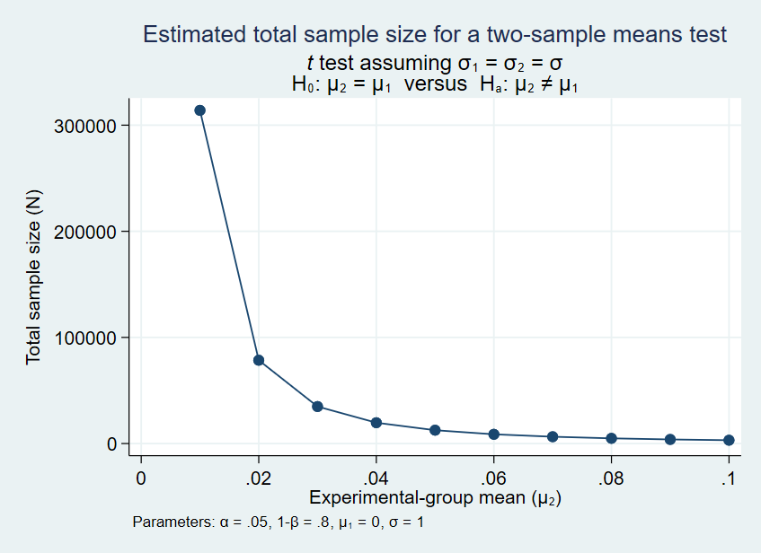
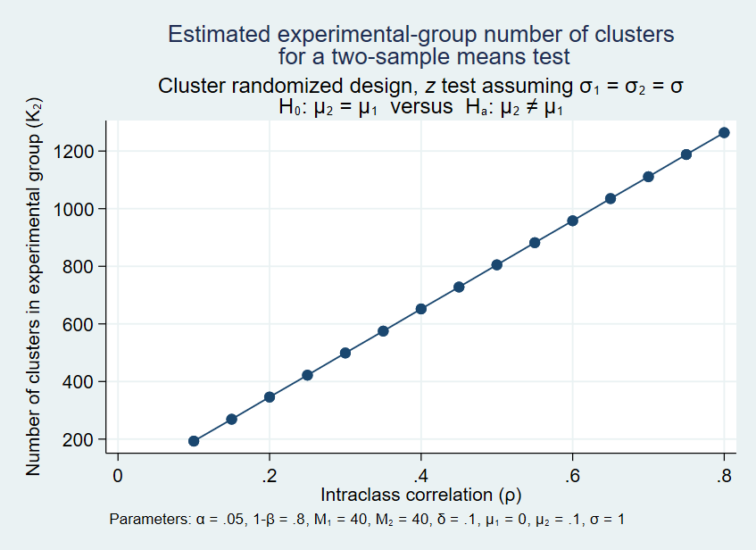

# Module 7 Stata Tutorial

This Stata tutorial accompanies __Module 7: Power Calculations__. The exercise covers power calculations for individually randomized and cluster randomized experiments. Unlike in previous Stata tutorials, no data accompanies this document. 

## Part 1: Individual level randomization 

First, suppose that you wish to calculate the sample size necessary for a randomized controlled trial. You plan to assign an equal number of people to the treatment and control groups. Assuming a test size of 0.05, calculate the total sample size required to detect a 0.1 standard deviation effect size with 80% power, using the `power` command.

__Task 1:__ Calculate the sample size required to detect a 0.1 standard deviation treatment effect 80% of the time with equal sized treatment and control groups. Set the probability of a Type I error at 5%.

__Execution 1:__ 

We use the command `power twomeans {hypothesized control mean} {hypothesized treatment mean}` where `twomeans` refers to the fact that we are comparing two means. The default standard deviation value is 1, so we do not need to specify that option. To test a 0.1 standard deviation effect size with a standard deviation of 1, we need the difference between the treatment mean and control mean to be 0.1. So means of 0 and 0.1 get us the result that we want. 

```
. power twomeans 0 0.1

Performing iteration ...

Estimated sample sizes for a two-sample means test
t test assuming sd1 = sd2 = sd
Ho: m2 = m1  versus  Ha: m2 != m1

Study parameters:

        alpha =    0.0500
        power =    0.8000
        delta =    0.1000
           m1 =    0.0000
           m2 =    0.1000
           sd =    1.0000

Estimated sample sizes:

            N =     3,142
  N per group =     1,571

```

Maintaining a 0.05 test size, what would the sample sizes need to be in order to detect at least a 0.01, 0.025, 0.05, 0.1, and 0.2 standard deviation effect with 80% power?

__Task 2:__ Create a table of the sample sizes needed to detect a 0.01, 0.025, 0.05, 0.1, and 0.2 standard deviation effect given the assumptions in *Task 1*. 

Hint: search `help power_opttable`

__Execution 2:__ 

The values `(0.01 0.025 0.05 0.1 0.2)` indicate all of the treatment means we wish to include in the table. The option `table(, labels(N "Sample size" sd "Std. Dev."))` indicates that we want to format the results in a table, and that we want "N" to be labeled as "Sample size" in the table and sd to be labeled as "Std. Dev."

```
. power twomeans 0 (0.01 0.025 0.05 0.1 0.2), table(, labels(N "Sample size" sd "Std. De
> v."))

Performing iteration ...

Estimated sample sizes for a two-sample means test
t test assuming sd1 = sd2 = sd
Ho: m2 = m1  versus  Ha: m2 != m1

  +-------------------------------------------------------------------------------+
  |   alpha   power Sample size      N1      N2   delta      m1      m2 Std. Dev. |
  |-------------------------------------------------------------------------------|
  |     .05      .8     3.1e+05 1.6e+05 1.6e+05     .01       0     .01         1 |
  |     .05      .8       50236   25118   25118    .025       0    .025         1 |
  |     .05      .8       12562   6,281   6,281     .05       0     .05         1 |
  |     .05      .8       3,142   1,571   1,571      .1       0      .1         1 |
  |     .05      .8         788     394     394      .2       0      .2         1 |
  +-------------------------------------------------------------------------------+

```

As expected, we can see that the required sample size increases non-linearly as the effect size approaches 0. 

The table is useful, but the calculations might be easier to interpret in a graph. Plot 0.01, 0.02, ..., 0.1 standard deviation treatment effects against sample size. 

__Task 3:__ Plot 0.01, 0.02, ..., 0.1 standard deviation treatment effects against sample size using the assumptions in *Task 1*. 

Hint: search `help power_optgraph`

__Execution 3:__ 

In this case, the term `(0.01(0.01)0.1)` indicates that we want to test treatment means from 0.01 to 0.1 in steps of 0.01 (so 0.01, 0.01..., 0.1). The "graph" option tells Stata to form a graph instead of printing each of the individual power calculations to the console. 

```
power twomeans 0 (0.01(0.01)0.1), graph

```



Now suppose that you know from a pilot study that the control mean of the outcome variable is 23.7, the experimental mean is 20.3, and the standard deviation is 17. What sample size is required to detect a program effect with 80% power and 95% confidence?

__Task 4:__ Calculate the total sample size necessary to detect an effect with 80% power and 95% confidence given a standard deviation of 17, a control mean of 23.7, and a treatment mean of 20.3. Assume that an equal number of people are assigned to the treatment and control group.

__Execution 4:__  

Since we are no longer using a standard deviation of 1, we need to specify the standard deviation using the `sd()` option. 

Alternatively, we could keep using our original syntax and instead use the command `power twomeans 0 -.2` (`-3.4/17 = -0.2`). You can see below that the results are identical.

```
. power twomeans 23.7 20.3, sd(17)

Performing iteration ...

Estimated sample sizes for a two-sample means test
t test assuming sd1 = sd2 = sd
Ho: m2 = m1  versus  Ha: m2 != m1

Study parameters:

        alpha =    0.0500
        power =    0.8000
        delta =   -3.4000
           m1 =   23.7000
           m2 =   20.3000
           sd =   17.0000

Estimated sample sizes:

            N =       788
  N per group =       394

. dis -3.4/17
-.2

. power twomeans 0 -.2

Performing iteration ...

Estimated sample sizes for a two-sample means test
t test assuming sd1 = sd2 = sd
Ho: m2 = m1  versus  Ha: m2 != m1

Study parameters:

        alpha =    0.0500
        power =    0.8000
        delta =   -0.2000
           m1 =    0.0000
           m2 =   -0.2000
           sd =    1.0000

Estimated sample sizes:

            N =       788
  N per group =       394


```

So you would need a sample size of at least 788. 

Perhaps instead the director of a program tells you that they will permit you to randomly assign 400 people to receive an intervention out of a total sample of 800. In standard deviations, what is the smallest effect size that you could detect with 80% power and 95% confidence? 

__Task 5:__ Calculate the smallest effect size, in standard deviations, that you could calculate with a total sample size of 800. 

__Execution 5:__ 

Since we are no longer making an assumption about the treatment mean, we now leave that parameter blank. But we now need to specify the `power` option and the `n` option so that Stata knows we want to calculate the treatment mean and has enough information to do so.

```
. power twomeans 0, power(0.8) n(800)

Performing iteration ...

Estimated experimental-group mean for a two-sample means test
t test assuming sd1 = sd2 = sd
Ho: m2 = m1  versus  Ha: m2 != m1; m2 > m1

Study parameters:

        alpha =    0.0500
        power =    0.8000
            N =       800
  N per group =       400
           m1 =    0.0000
           sd =    1.0000

Estimated effect size and experimental-group mean:

        delta =    0.1983
           m2 =    0.1983

```

So you would be able to detect an effect size just a little under 0.2 standard deviations or larger.

## Part 2: Randomized clusters 

In this section, we perform power calculations in the case of cluster randomized controlled trials. The commands are largely the same as in the case of individual randomization, although several additional parameters must be added. As a result, this section is much shorter. 

Suppose that you are planning an RCT and due to concerns of spillover effects, you decide to randomize at the village level. What is the total sample size required to detect a 0.1 standard deviation effect 80% of the time with 95% confidence? Assume that you plan to survey 40 people from each village. Suppose that the intra-cluster correlation is 0.1.

__Task 6:__ Calculate the sample size needed to detect a 0.1 standard deviation effect with a cluster size of 40 and intra-cluster correlation of 0.1.

__Execution 6:__ 

The option `m1()` specifies the cluster size. As soon as we add this, Stata knows that we are using a randomized cluster design. The parameter `rho()` is intra-cluster correlation. If we leave it blank, Stata will use a value of 0.5.

```
. power twomeans 0 0.1, m1(40) rho(0.1)

Performing iteration ...

Estimated numbers of clusters for a two-sample means test
Cluster randomized design, z test assuming sd1 = sd2 = sd
Ho: m2 = m1  versus  Ha: m2 != m1

Study parameters:

        alpha =    0.0500
        power =    0.8000
        delta =    0.1000
           m1 =    0.0000
           m2 =    0.1000
           sd =    1.0000

Cluster design:

           M1 =        40
           M2 =        40
          rho =    0.1000

Estimated numbers of clusters and sample sizes:

           K1 =       193
           K2 =       193
           N1 =     7,720
           N2 =     7,720

```

So 193 treatment and control villages are required, leading to a total sample size of 15,440.

Let's next examine how changing our assumption about the intra-cluster correlation alters the required sample size. Construct a graph of the number of villages (in both the treatment and control groups) required to detect an effect for intra-cluster correlations between 0.1 and 0.8.

__Task 7:__ Construct a graph of the number of clusters required given intra-cluster correlations between 0.1 and 0.8. Use the same assumptions as in *Task 6*. 

__Execution 7:__ 

The option `rho(0.1(0.05)0.8)` tells Stata to test ICC values between 0.1 and 0.8 in blocks of 0.05 (0.1, 0.15, 0.2, ..., 0.8). The `graph` option formats the results in a graph instead of printing the results.

```
power twomeans 0 0.1, m1(40) rho(0.1(0.05)0.8) graph

```


As the intra-cluster correlation increases, the value of interviewing multiple people in the same village decreases. As a result, with an ICC of 0.8, a total sample size of over 96,000 would be required. 

Finally, fix the ICC at 0.1 and examine how the total required sample size changes with cluster sizes of 10, 20, 30, 40, and 50. Present the results in a table. 

__Task 8:__ Construct a table showing how the required total sample size needed to detect an effect size of 0.1 standard deviations changes as the cluster size is varied between 10 and 50. Use the same assumptions as in *Task 6*. 

__Execution 8:__ 

The option `m1(10 20 30 40 50)` instructs Stata to try cluster sizes of 10, 20, 30, 40, and 50. The option `table(N, add)` tells Stata to format the results in a table and to display the total sample size which is not rendered by default. 

```
. power twomeans 0 0.1, m1(10 20 30 40 50) rho(0.1) table(N, add)

Performing iteration ...

Estimated numbers of clusters for a two-sample means test
Cluster randomized design, z test assuming sd1 = sd2 = sd
Ho: m2 = m1  versus  Ha: m2 != m1


  +-------------------------------------------------------------------------------------------------+
  |   alpha   power      K1      K2      M1      M2   delta      m1      m2      sd     rho       N |
  |-------------------------------------------------------------------------------------------------|
  |     .05      .8     299     299      10      10      .1       0      .1       1      .1   5,980 |
  |     .05      .8     228     228      20      20      .1       0      .1       1      .1   9,120 |
  |     .05      .8     205     205      30      30      .1       0      .1       1      .1   12300 |
  |     .05      .8     193     193      40      40      .1       0      .1       1      .1   15440 |
  |     .05      .8     186     186      50      50      .1       0      .1       1      .1   18600 |
  +-------------------------------------------------------------------------------------------------+


```

To conclude, we also note that there are tools outside of Stata that can simplify power calculations. For instance, [Optimal Design](http://hlmsoft.net/od/) is a commonly used program that is popular because it is freely available and easy to use. In addition, Excel templates are available that allow you to easily vary parameters to see how sample sizes change. 
