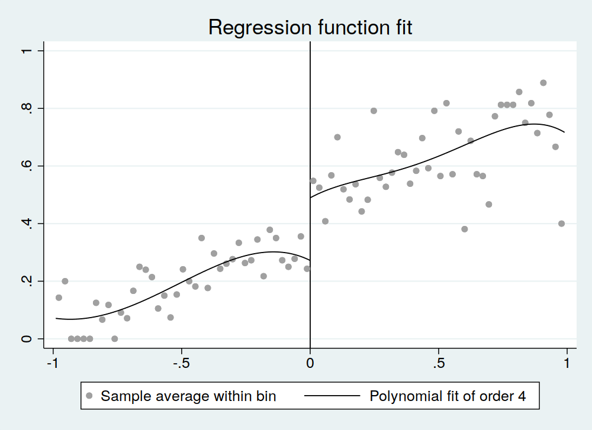
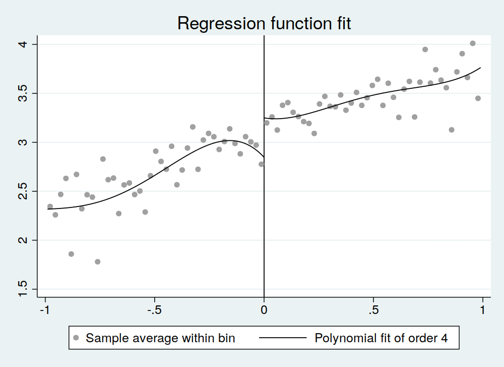

# Module 9 Stata Tutorial

This tutorial introduces the Stata commands associated with the content in __Module 9: Regression Discontinuity Designs__.

The data we use is from a study by Owen Ozier, who uses a regression-discontinuity design to evaluate the impact of secondary schooling in Kenya (Ozier, Owen. "The Impact of Secondary Schooling in Kenya: A Regression Discontinuity Analysis." Journal of Human Resources 53, no. 1 (2018): 157-188. https://www.muse.jhu.edu/article/684446.). The data can be downloaded from the course page.

As with past tutorials, we caution that we are simplifying the analysis in order to illustrate how to accomplish core concepts in Stata. As a result, we may not arrive at precisely the same numerical results as published in the paper. If you would like to see the complete results, we encourage you to read the full study.

The paper estimates the effect of secondary schooling on future outcomes by exploiting a jump in the probability of admission to secondary school as performance on a national primary school examination crosses a threshold. We will first examine the probability of gaining admission to secondary school on each side of the jump in order to test the viability of the RDD design. We will then estimate the effect of secondary school on non-verbal reasoning and vocabulary using an RDD design.


__Task 1:__ Import `module_9_data.dta` and describe the observations.

__Execution 1:__ 
```
. set more off 

. drop _all 

. 
. use "Data/module_9_data.dta", clear 

. 
. describe 

Contains data from Data/module_9_data.dta
  obs:         2,169                          
 vars:             5                          2 Dec 2019 14:45
                                              (_dta has notes)
-------------------------------------------------------------------------------
              storage   display    value
variable name   type    format     label      variable label
-------------------------------------------------------------------------------
test            float   %9.0g                 Test score (centered at 0)
jump            byte    %9.0g                 Score 0 or higher
secondary       byte    %9.0g                 Completed secondary school
rv              float   %9.0g                 Ravens Matrices plus Vocabulary
female          byte    %9.0g                 Female
-------------------------------------------------------------------------------
Sorted by: 

. 
``` 

The data should have 5 variables and 2,169 observations. Test scores are normalized to be centered on zero, and range from -2.51 to 1.68.

We will now estimate the relationship between the (normalized) test score and the probability of attending secondary school, allowing for a jump at zero. We restrict the sample to include only scores between -0.8 and 0.8.

__Task 2:__ Regress `secondary` on `test`, `jump`, and an interaction between `test` and `jump`. Note that `test` is centered such that `jump = 1` corresponds with `test = 0`.

__Execution 2:__ 

```

. generate testxjump = test*jump 

. label var testxjump "Test x jump"

. 
. regress secondary test jump testxjump if abs(test) < 0.8, robust 

Linear regression                               Number of obs     =      1,943
                                                F(3, 1939)        =     113.17
                                                Prob > F          =     0.0000
                                                R-squared         =     0.1355
                                                Root MSE          =     .45945

------------------------------------------------------------------------------
             |               Robust
   secondary |      Coef.   Std. Err.      t    P>|t|     [95% Conf. Interval]
-------------+----------------------------------------------------------------
        test |   .2669451   .0596499     4.48   0.000     .1499604    .3839297
        jump |   .1635833   .0384829     4.25   0.000      .088111    .2390555
   testxjump |   .0187127   .0922918     0.20   0.839    -.1622889    .1997144
       _cons |   .3302689   .0255049    12.95   0.000      .280249    .3802889
------------------------------------------------------------------------------
```

This is a linear probability model, with a jump at zero, with the restriction that the slope of the relationship between test scores and attendance is the same on both sides of the cut-off.  The results suggest that receiving a score above the cutoff appears to increase the probability of receiving secondary education.  That is, the coefficient on `jump` is 0.1636, and is highly statistically significant.

However, we might be concerned that this result is driven by our linearity assumption, and that the true relationship between test scores and attendance could exhibit non-linearities.  Install the command `rdplot` by entering the command `ssc install rdrobust`. Then use `rdplot` to plot the probability of receiving secondary education by test score, only considering test scores between -1 and 1.  This command will create polynomial graphs on each side of the cut-off.

__Task 3:__ Use `rdplot` to plot the probability of completing secondary school by test score, considering test scores between -1 and 1.

__Execution 3:__ 

```
. ssc install rdrobust 
. rdplot secondary test if abs(test) < 1, c(0)

RD Plot with evenly spaced mimicking variance number of bins using spacings estimators.

         Cutoff c = 0 | Left of c  Right of c        Number of obs  =       2079
----------------------+----------------------        Kernel         =    Uniform
        Number of obs |      1018        1061
   Eff. Number of obs |      1018        1061
  Order poly. fit (p) |         4           4
     BW poly. fit (h) |     0.990       0.990
 Number of bins scale |     1.000       1.000

Outcome: secondary. Running variable: test.
---------------------------------------------
                      | Left of c  Right of c
----------------------+----------------------
        Bins selected |        41          42
   Average bin length |     0.024       0.024
    Median bin length |     0.024       0.024
----------------------+----------------------
    IMSE-optimal bins |         5           5
  Mimicking Var. bins |        41          42
----------------------+----------------------
Rel. to IMSE-optimal: | 
        Implied scale |     8.200       8.400
    WIMSE var. weight |     0.002       0.002
    WIMSE bias weight |     0.998       0.998
---------------------------------------------

```

```
. graph export "Graphs/secondary_education.png", width(1000) replace
(note: file Graphs/secondary_education.png not found)
(file Graphs/secondary_education.png written in PNG format)

```

Each dot represents the secondary school attendance rate of about 25 observations of individuals with scores around that value.  Although the dots bounce around, so there is a lot of variation around the plotted lines, the figure provides further evidence of a jump in the probability of attending secondary school as the cut-off test score of zero is crossed.

Next, we estimate of the effect of the test score on verbal reasoning and vocabulary scores using the variable `rv`, as before allowing for a jump at the score of zero. The variable `rv` is a combined Z-score constructed from a test designed to measure cognitive ability, so it measures scores in standard deviations relative to the average respondent. 

Again, only consider values of the variable `test` between -0.8 and 0.8.

__Task 4:__ Regress `rv` on `test`, `jump`, and an interaction between `test` and `jump`. 

__Execution 4:__ 

```
. regress rv test jump testxjump if abs(test) < 0.8, robust 

Linear regression                               Number of obs     =      1,923
                                                F(3, 1919)        =     127.95
                                                Prob > F          =     0.0000
                                                R-squared         =     0.1688
                                                Root MSE          =     .69695

------------------------------------------------------------------------------
             |               Robust
          rv |      Coef.   Std. Err.      t    P>|t|     [95% Conf. Interval]
-------------+----------------------------------------------------------------
        test |   .8070675   .1139597     7.08   0.000     .5835695    1.030565
        jump |   .1159352   .0564528     2.05   0.040     .0052199    .2266504
   testxjump |   -.260143   .1456776    -1.79   0.074     -.545846      .02556
       _cons |   3.082658   .0422659    72.93   0.000     2.999766     3.16555
------------------------------------------------------------------------------


```

Again, we’ve used a simple linear regression, assuming a constant slope on either side of the cut-off. The results suggest that scoring above the cutoff leads to a statistically significant increase in the combined reasoning and vocabulary score. Individuals to the right of the cutoff score about 0.115 standard deviations higher on average, suggesting that attending secondary school increases reasoning and vocabulary skills.

Because the probability of attending secondary school does not jump from zero to one, but increases by only about 16 percentage points (see the coefficient on `jump` in Task 2 above), we have a fuzzy RDD design. That coefficient in the regression of learning outcomes on test scores, is thus the intent to treat (ITT) estimate of the effect of attending secondary school on combined reasoning and vocabulary scores.

To calculate the local average treatment effect (LATE), that is, the effect of secondary school on those who were admitted because they just passed the threshold, but otherwise would not have been, we use a two-stage least squares regression.

__Task 5:__ Use the `ivregress` command to estimate the LATE of completing secondary school on `rv`, using `jump` as an instrument for completing secondary school. 

__Execution 5:__ 

```
. ivregress 2sls rv test testxjump (secondary = jump) if abs(test) < 0.8, robust

Instrumental variables (2SLS) regression          Number of obs   =      1,923
                                                  Wald chi2(3)    =     472.16
                                                  Prob > chi2     =     0.0000
                                                  R-squared       =     0.3150
                                                  Root MSE        =     .63206

------------------------------------------------------------------------------
             |               Robust
          rv |      Coef.   Std. Err.      z    P>|z|     [95% Conf. Interval]
-------------+----------------------------------------------------------------
   secondary |   .6945017   .3142256     2.21   0.027     .0786309    1.310372
        test |    .622253   .1700206     3.66   0.000     .2890187    .9554873
   testxjump |  -.2734181   .1339797    -2.04   0.041    -.5360135   -.0108228
       _cons |   2.853759   .1354842    21.06   0.000     2.588215    3.119303
------------------------------------------------------------------------------
Instrumented:  secondary
Instruments:   test testxjump jump

```

The LATE is about 0.695 (which corresponds closely to the ratio of the ITT effect to the compliance rate) and this result is statistically significant. So for the compliers, attending secondary school increases performance on the verbal reasoning and vocabulary tests by almost 0.7 standard deviations.

Finally, we create a plot demonstrating the change in learning outcomes as captured in the variable `rv` as test scores cross the cutoff.

__Task 6:__ Use `rdplot` to plot `rv` by test score, considering test scores between -1 and 1.

__Execution 6:__ 

```
. rdplot rv test if abs(test) < 1, c(0)

RD Plot with evenly spaced mimicking variance number of bins using spacings estimators.

         Cutoff c = 0 | Left of c  Right of c        Number of obs  =       2059
----------------------+----------------------        Kernel         =    Uniform
        Number of obs |      1006        1053
   Eff. Number of obs |      1006        1053
  Order poly. fit (p) |         4           4
     BW poly. fit (h) |     0.990       0.990
 Number of bins scale |     1.000       1.000

Outcome: rv. Running variable: test.
---------------------------------------------
                      | Left of c  Right of c
----------------------+----------------------
        Bins selected |        41          41
   Average bin length |     0.024       0.024
    Median bin length |     0.024       0.024
----------------------+----------------------
    IMSE-optimal bins |         8           6
  Mimicking Var. bins |        41          41
----------------------+----------------------
Rel. to IMSE-optimal: | 
        Implied scale |     5.125       6.833
    WIMSE var. weight |     0.007       0.003
    WIMSE bias weight |     0.993       0.997
---------------------------------------------

```

```
. graph export "Graphs/rv.png", width(1000) replace
(note: file Graphs/rv.png not found)
(file Graphs/rv.png written in PNG format)

```

The graph again shows the reasoning and vocabulary scores increase as we cross the cutoff at 0. 
